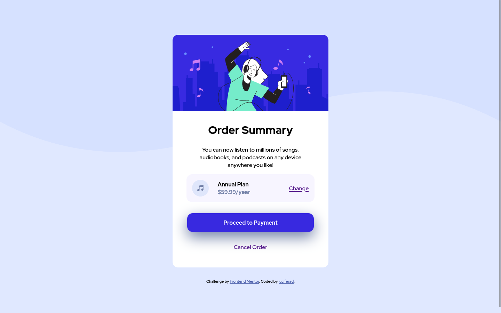

# Frontend Mentor - Order summary card solution

This is a solution to the [Order summary card challenge on Frontend Mentor](https://www.frontendmentor.io/challenges/order-summary-component-QlPmajDUj). Frontend Mentor challenges help you improve your coding skills by building realistic projects. 

## Table of contents

- [Overview](#overview)
  - [The challenge](#the-challenge)
  - [Screenshot](#screenshot)
  - [Links](#links)
- [My process](#my-process)
  - [Built with](#built-with)
  - [What I learned](#what-i-learned)
  - [Continued development](#continued-development)
  - [Useful resources](#useful-resources)
- [Author](#author)

## Overview

This is my third project on the web. These are my first steps to learning about web. I'm passionate about learning everything around computers & web. I've learned HTML & CSS for beginning & now I'm practicing them. I'm curious about many thing like JS, Git, Github and so on.

### The challenge

Users should be able to:

- See hover states for interactive elements

### Screenshot



### Links

- Solution URL: [My Solution](https://github.com/luciferad/order-summary-component-main)
- Live Site URL: [My Live Site URL](https://luciferad.github.io/order-summary-component-main/)

## My process

First of all I wrote html tags. I divided the body into two divisions, 'main' & 'footer'. after that I use Flexbox to center them in the middle of viewport. The main card was divided into two areas with Grid. One area for the image and the other one for rest of components. After HTML tags I use CSS for styling components. The width of the main card was wider than mobile width (375px), because of it, I use @media query to make a narrower version of the main card for mobile viewports.

### Built with

- Semantic HTML5 markup
- CSS custom properties
- Flexbox
- CSS Grid

### What I learned

I've learned about box-shadow property in this project. I manipulated the values to see how it works.

```css
.proud-of-this-css {
  box-shadow: 0 15px 40px var(--desaturated-blue);
}
```

If you want more help with writing markdown, we'd recommend checking out [The Markdown Guide](https://www.w3schools.com/cssref/css3_pr_box-shadow.asp) to learn more.

### Continued development

I'm a beginner in front-end development. I want to work with HTML & CSS for a while. I'm passionate about using SASS.

### Useful resources

- [Learning Web Design](https://www.amazon.com/Learning-Web-Design-Beginners-JavaScript/dp/1491960205) - This helped me to learn principles.
- [w3schools](https://www.w3schools.com) - w3schools is a reference guid. 

## Author

- github - [@luciferad](https://github.com/luciferad/)
- Frontend Mentor - [@luciferad](https://www.frontendmentor.io/profile/luciferad)